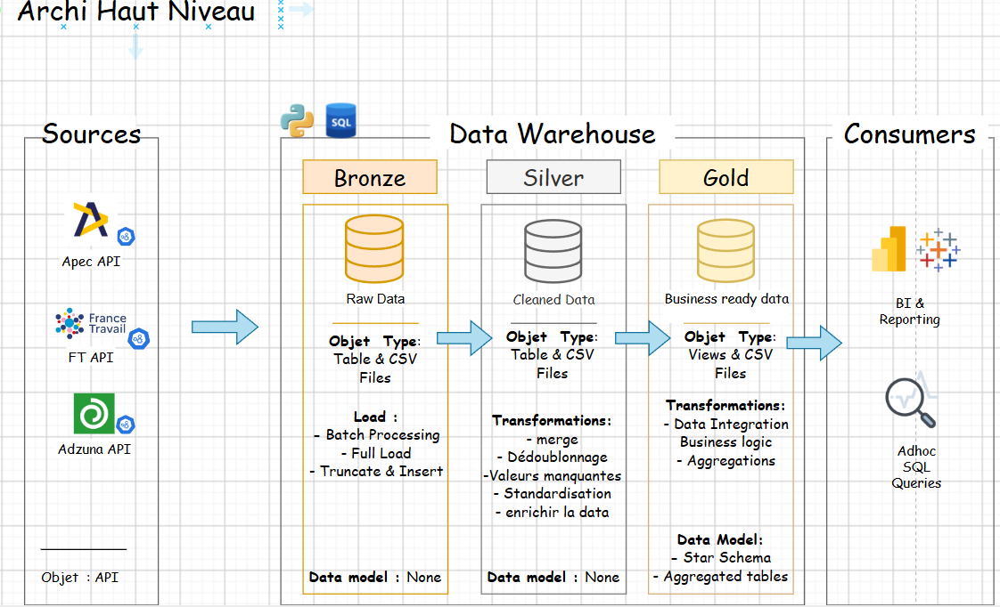

<p align="center">
  
</p>

<h1 align="center">Analyse de l'Employabilité Data Science</h1>

<p align="center">
  ETL médaillon (Bronze → Silver → Gold) qui collecte, nettoie et enrichit des offres d'emploi Data
  <br/>via 3 API officielles, pour analyser le marché de l'emploi Data Science en France.
</p>

<p align="center">
  
  
  
  
</p>

<p align="center">
  <a href="https://public.tableau.com/app/profile/takougang.kuatse.ronic/viz/Projet_Visualisation_17740458603320/Job_Market">
    
  </a>
</p>

---

## Sommaire

- [Aperçu](#aperçu)
- [Dashboard](#dashboard)
- [Architecture](#architecture)
- [Structure du projet](#structure-du-projet)
- [Stack technique](#stack-technique)
- [Installation](#installation)
- [Utilisation](#utilisation)
- [Tests](#tests)
- [Documentation](#documentation)
- [Limites connues](#limites-connues)
- [Auteur](#auteur)

## Aperçu

Ce projet scrape des offres d'emploi Data Science depuis 3 API officielles
(APEC, France Travail, Adzuna), les nettoie, les déduplique et les
enrichit (compétences détectées, catégorie de poste, expérience requise,
salaire) pour produire un dataset analysable du marché de l'emploi Data
en France. L'ensemble suit une **architecture médaillon** (Bronze →
Silver → Gold) et alimente à la fois des exports CSV et un entrepôt SQL
avec un vrai **schéma en étoile**.

Dernier run réel :

| Métrique | Valeur |
|---|---|
| Offres collectées (après dédoublonnage) | **8 679** |
| Sources | APEC (2 467) · Adzuna (4 813) · France Travail (1 399) |
| Compétences techniques suivies | ~45 (Python, SQL, Spark, Power BI, AWS, ...) |
| Dataset final | `data/gold/offres_enriched.csv` |
| Entrepôt SQL | `data/warehouse.db` (SQLite, table `gold_offres` + schéma en étoile) |

## Dashboard

Le dataset final est visualisé dans un dashboard Tableau interactif :

**[public.tableau.com — Job Market Dashboard](https://public.tableau.com/app/profile/takougang.kuatse.ronic/viz/Projet_Visualisation_17740458603320/Job_Market)**

Connecté directement à `data/warehouse.db` — voir [Requêter le résultat en SQL](#utilisation) pour reproduire les agrégats affichés.

## Architecture

<p align="center">
   Bronze/Silver/Gold -> Consumers" width="880"/>
</p>

3 API sources → couche **Bronze** (extraction brute) → couche **Silver**
(nettoyage, conformité) → couche **Gold** (enrichissement métier, schéma
en étoile) → consommation (SQL, Tableau). Chaque couche est à la fois un
CSV et une table SQL dans `data/warehouse.db`.

Détail complet des 3 couches, du flux de données et du schéma en étoile :
[`docs/architecture.md`](docs/architecture.md).
Dictionnaire des colonnes du dataset final : [`docs/data_catalog.md`](docs/data_catalog.md).

## Structure du projet

```
Job_Scrappers/
├── data/
│   ├── bronze/            # sorties brutes des scrapers (non versionné)
│   ├── silver/             # fusionné + nettoyé
│   ├── gold/                # offres_enriched.csv = dataset final
│   │   └── legacy/           # anciens exports manuels, référence historique (non versionné)
│   └── warehouse.db          # SQLite : bronze_offres / silver_offres / gold_offres + schéma en étoile
├── docs/                   # architecture, data catalog, conventions
├── src/
│   ├── config.py           # constantes métier centralisées
│   ├── warehouse.py        # chargement des couches dans SQLite
│   ├── bronze/               # 1 scraper par source
│   ├── silver/                # fusion + nettoyage
│   └── gold/                  # enrichissement + schéma en étoile
├── tests/                  # tests pytest (32 tests, silver + gold)
├── main.py                 # orchestrateur CLI
└── requirements.txt
```

## Stack technique

| Domaine | Outils |
|---|---|
| Langage | Python 3.11+ |
| Traitement de données | pandas |
| Extraction | requests, API REST/OAuth2 |
| Entrepôt | SQLite (schéma en étoile) |
| Visualisation | Tableau |
| Tests | pytest |

## Installation

```bash
python -m venv env
source env/bin/activate  # ou .\env\Scripts\activate sous Windows
pip install -r requirements.txt
```

Copier `.env.example` en `.env` et renseigner les identifiants des API
France Travail (`CLIENT_ID`/`CLIENT_SECRET`) et Adzuna
(`ADZUNA_APP_ID`/`ADZUNA_APP_KEY`) — voir les commentaires dans le
fichier pour où les obtenir (les deux sont gratuits).

## Utilisation

```bash
python main.py --stage silver              # fusion + nettoyage
python main.py --stage gold                # enrichissement
python main.py --stage all                 # silver + gold (bronze ignoré par défaut)
python main.py --stage all --with-bronze   # relance aussi le scraping (lent)
```

Le scraping (bronze) n'est pas relancé par défaut dans `--stage all` :
interroger les 3 API prend plusieurs minutes (pagination sur plusieurs
milliers d'offres).

Requêter le résultat en SQL :

```bash
sqlite3 data/warehouse.db "SELECT job_category, COUNT(*) FROM gold_offres GROUP BY job_category;"
```

## Tests

```bash
python -m pytest tests/
```

32 tests couvrant la standardisation des contrats, la détection de
région, l'extraction de compétences (dont les cas de faux positifs
corrigés) et la catégorisation de poste.

## Documentation

| Document | Contenu |
|---|---|
| [`docs/architecture.md`](docs/architecture.md) | Détail des 3 couches, schéma en étoile, requêtes SQL d'exemple |
| [`docs/data_catalog.md`](docs/data_catalog.md) | Dictionnaire de colonnes du dataset final |
| [`docs/naming_conventions.md`](docs/naming_conventions.md) | Conventions de nommage du projet |

## Limites connues

- **Descriptions tronquées à la source** pour APEC (~283 caractères) et
  Adzuna (~500 caractères) — leurs endpoints de recherche renvoient un
  résumé, pas le texte complet, ce qui limite le rappel de la détection
  de compétences sur ces 2 sources
- **Salaire renseigné sur ~47% des offres**, **niveau d'étude détecté
  sur ~14%** — dépend de ce que chaque source remplit réellement, peu
  d'action possible côté pipeline
- Détail complet dans [`docs/data_catalog.md`](docs/data_catalog.md#limite-connue--descriptions-tronquées-apec-adzuna)

## Auteur

**Ronic Takougnag**
Étudiant - Université Paris 8 (IA & Data Science)
