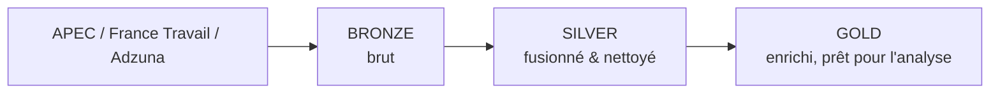

<p align="center">
  
</p>

# Analyse de l'Employabilité Data Science

ETL Python qui collecte des offres d'emploi Data via 3 API officielles
(APEC, France Travail, Adzuna), les nettoie et les enrichit (compétences,
séniorité, catégorie de poste, salaire) pour analyser le marché de
l'emploi Data Science en France. Organisé en **architecture médaillon**
(Bronze → Silver → Gold).

Dernier run réel : **9613 offres** (3447 APEC + 1398 France Travail +
4768 Adzuna, après dédoublonnage) → `data/gold/offres_enriched.csv`,
**le dataset final**, aussi disponible en SQL (table `gold_offres` dans
`data/warehouse.db`, SQLite) pour requêtage direct ou connexion Tableau.
La couche gold est en plus modélisée en **schéma en étoile**
(`fact_offres` + dimensions entreprise/localisation/date/source/compétence)
dans la même base — voir [`docs/architecture.md`](docs/architecture.md).

## Architecture



Détail complet des 3 couches, du flux de données et des choix de
conception : [`docs/architecture.md`](docs/architecture.md).
Dictionnaire des colonnes du dataset final : [`docs/data_catalog.md`](docs/data_catalog.md).

## Structure du projet

```
Job_Scrappers/
├── data/
│   ├── bronze/          # sorties brutes des scrapers (non versionné)
│   ├── silver/           # fusionné + nettoyé
│   ├── gold/              # offres_enriched.csv = dataset final
│   │   └── legacy/        # anciens exports manuels, référence historique (non versionné)
│   └── warehouse.db       # SQLite : bronze_offres / silver_offres / gold_offres
├── docs/                 # architecture, data catalog, conventions
├── src/
│   ├── config.py         # constantes métier centralisées
│   ├── warehouse.py      # chargement des couches dans SQLite
│   ├── bronze/            # 1 scraper par source
│   ├── silver/            # fusion + nettoyage
│   └── gold/              # enrichissement
├── tests/                # tests pytest (silver + gold)
├── main.py               # orchestrateur CLI
└── requirements.txt
```

## Stack technique

Python · pandas · requests · pytest

## Installation

```bash
python -m venv env
source env/bin/activate  # ou .\env\Scripts\activate sous Windows
pip install -r requirements.txt
```

Copier `.env.example` en `.env` et renseigner les identifiants des API
France Travail (`CLIENT_ID`/`CLIENT_SECRET`) et Adzuna
(`ADZUNA_APP_ID`/`ADZUNA_APP_KEY`) — voir les commentaires dans le
fichier pour où les obtenir (les deux sont gratuits).

## Utilisation

```bash
python main.py --stage silver              # fusion + nettoyage
python main.py --stage gold                # enrichissement
python main.py --stage all                 # silver + gold (bronze ignoré par défaut)
python main.py --stage all --with-bronze   # relance aussi le scraping (lent)
```

Le scraping (bronze) n'est pas relancé par défaut dans `--stage all` :
interroger les 3 API prend plusieurs minutes (pagination sur plusieurs
milliers d'offres).

Requêter le résultat en SQL :

```bash
sqlite3 data/warehouse.db "SELECT job_category, COUNT(*) FROM gold_offres GROUP BY job_category;"
```

## Tests

```bash
python -m pytest tests/
```

## Auteur

**Ronic Takougnag**
Étudiant - Université Paris 8 (IA & Data Science)
