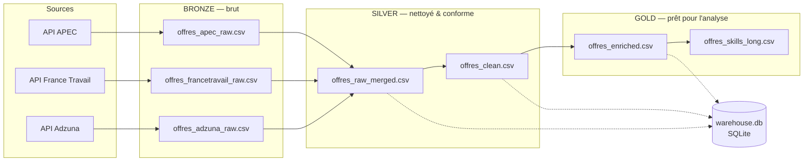
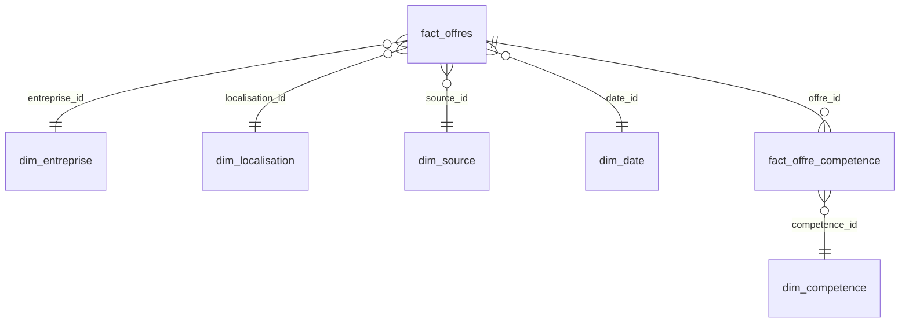

# Architecture

Ce projet suit une **architecture médaillon** à 3 couches, chacune
correspondant à un niveau de qualité/structuration croissant des données.



## Bronze — `src/bronze/`

Extraction brute depuis chaque source, sans transformation métier :
- `scraper_apec.py` : API JSON publique
- `scraper_francetravail.py` : API officielle OAuth2 (nécessite `.env`)
- `scraper_adzuna.py` : API officielle (nécessite `.env`)

Sortie : un CSV par source dans `data/bronze/`, tel quel depuis la source.
Les 3 sources sont des API publiques/officielles — pas de scraping HTML
fragile, donc pas de dépendance à un anti-bot ou à la structure d'une
page qui peut changer sans préavis.

## Silver — `src/silver/`

1. `merge.py` : concatène les CSV bronze disponibles → `offres_raw_merged.csv`
2. `clean.py` : déduplique, standardise les types de contrat (`job_type`),
   déduit la région française à partir de la localisation, estime la
   séniorité à partir du titre → `offres_clean.csv`

## Gold — `src/gold/`

`enrich.py` :
- détecte ~45 compétences techniques dans la description (regex, voir
  `src/config.py:SKILL_PATTERNS`)
- estime l'expérience requise et le niveau d'étude
- catégorise le poste (Data Scientist / Data Engineer / Data Analyst / ...)
- produit **`offres_enriched.csv`**, le dataset final (une ligne par offre,
  une colonne par compétence détectée), et `offres_skills_long.csv`, la
  même donnée en format long (une ligne par couple offre/compétence) pour
  un `melt`/une agrégation côté Tableau ou SQL

## Entrepôt SQL — `data/warehouse.db`

En plus des CSV, chaque couche est chargée dans une base **SQLite**
(`src/warehouse.py`), sous 3 tables miroir des CSV, requêtables
directement en SQL :

| Table | Contenu |
|---|---|
| `bronze_offres` | Fusion brute des 3 sources, avant nettoyage |
| `silver_offres` | Après déduplication/standardisation (= `offres_clean.csv`) |
| `gold_offres` | Dataset final enrichi, format plat (= `offres_enriched.csv`) |

```bash
sqlite3 data/warehouse.db "SELECT job_category, COUNT(*) FROM gold_offres GROUP BY job_category;"
```

SQLite est un fichier unique, sans serveur à installer — connectable
directement depuis Tableau, DBeaver, ou n'importe quel client SQL.

### Schéma en étoile (`src/gold/star_schema.py`)

En plus du format plat `gold_offres`, la couche gold est modélisée en
**schéma en étoile** — un fait entouré de dimensions, le format standard
d'un entrepôt de données :



- **`fact_offres`** (grain : une ligne par offre) : mesures (`salaire_min`,
  `salaire_max`, extraits du texte libre — voir `_parse_salaire`) + clés
  étrangères vers les dimensions + attributs catégoriels simples
  (`job_type`, `job_category`, `experience_estimee`,
  `niveau_etude_estime`) gardés en dimensions dégénérées plutôt que
  dimensionnés séparément, pour ne pas multiplier les tables sur un
  projet de cette taille
- **`dim_entreprise`, `dim_localisation`, `dim_source`, `dim_date`** :
  dimensions classiques
- **`dim_competence`** + **`fact_offre_competence`** : une compétence
  peut concerner plusieurs offres et une offre plusieurs compétences
  (relation many-to-many) — modélisée par une table de faits pont
  (bridge table), pas une dimension

Exemple de requête multi-tables :

```sql
SELECT l.region, ROUND(AVG((f.salaire_min + f.salaire_max) / 2.0)) AS salaire_moyen
FROM fact_offres f
JOIN dim_localisation l ON f.localisation_id = l.localisation_id
WHERE f.salaire_min IS NOT NULL
GROUP BY l.region
ORDER BY salaire_moyen DESC;
```

## Orchestration

`main.py` expose une étape par couche :

```bash
python main.py --stage silver   # merge + clean (+ chargement SQL)
python main.py --stage gold     # enrich (+ chargement SQL)
python main.py --stage all      # silver + gold (bronze ignoré par défaut)
python main.py --stage all --with-bronze   # relance aussi le scraping
```

Le bronze est ignoré par défaut dans `--stage all` car interroger les 3
API (plusieurs milliers d'offres, pagination) prend plusieurs minutes —
on ne le relance qu'à la demande.

## Écart connu avec `data/gold/legacy/`

`data/gold/legacy/` contient les derniers exports produits avant cette
réorganisation (`jobs_dataset_final_v5.csv` notamment). Ces fichiers ont
des colonnes (`job_category_clean`, `duree_contrat`, `region_standardisee`,
`salaire_estime`) qui ne sont **pas** générées par le pipeline actuel — ils
ont été retouchés manuellement hors du code versionné. Le pipeline dans
`src/` fait foi ; ces fichiers sont conservés comme référence historique,
pas comme cible à reproduire. Voir `docs/data_catalog.md` pour le détail.
